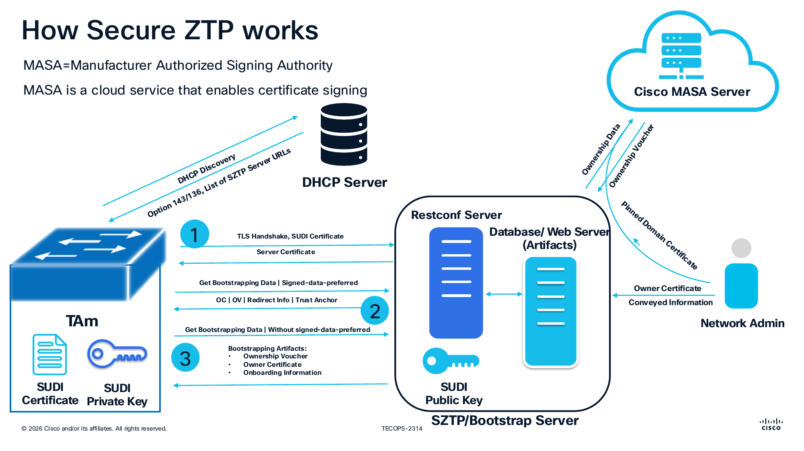
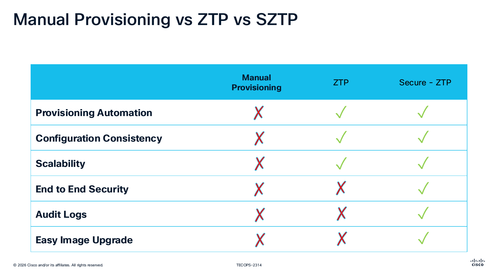
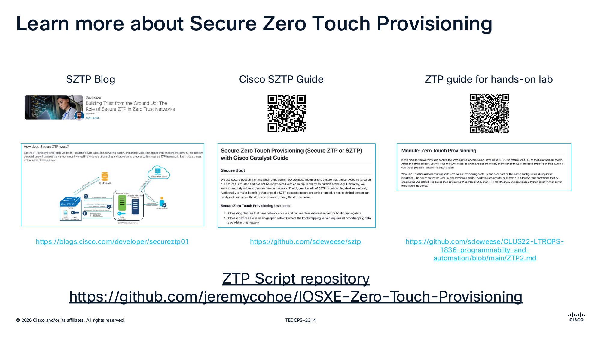

# Day 0 - Device Onboarding

## Overview

Day 0 focuses on the initial onboarding and bootstrapping of network devices using modern, secure, zero-touch provisioning methods.

### What You'll Learn

- Secure Zero Touch Provisioning (SZTP) fundamentals
- Automated device onboarding workflows
- Certificate-based authentication
- MASA (Manufacturer Authorized Signing Authority) integration

### Topics Covered

1. **SZTP Concepts**: Understanding the zero-touch provisioning workflow
2. **Ownership Vouchers**: Generating and managing vouchers for device authentication
3. **Bootstrap Configuration**: Automating initial device setup
4. **Security Best Practices**: Certificate management and secure onboarding

### SZTP with Enterprise Networking 

### SZTP Workflow

1. Device powers on and starts secure onboarding discovery.

2. Device establishes initial trust signaling using device identity (SUDI) and TLS context.

   **How the SUDI Certificate Is Used**

   SUDI (Secure Unique Device Identifier) is the device identity certificate installed by the manufacturer.

   - The switch presents SUDI during the secure handshake to prove hardware identity.
   - The onboarding services use SUDI identity attributes (for example serial-linked identity) to correlate requests with ownership records.
   - SUDI-based identity is a key input to trust decisions before voucher/onboarding artifacts are accepted.

   In short: SUDI proves who the device is, while MASA and signed artifacts prove what the device is allowed to do.

3. Device requests bootstrapping data from MASA and/or bootstrap infrastructure.

   **What Is MASA?**

   MASA (Manufacturer Authorized Signing Authority) is a manufacturer-trusted service that helps prove device ownership during onboarding.

   - MASA validates ownership context for a device serial number.
   - MASA provides signed ownership-voucher material used in the SZTP trust flow.
   - The switch uses that signed proof to decide whether to trust the onboarding authority and continue Day 0 provisioning.

   In short: MASA is the trust anchor service that prevents unauthorized devices or untrusted onboarding paths from being accepted.

4. Bootstrap artifacts are returned and validated:
   - **Ownership Voucher (OV)**: A MASA-signed artifact that proves the device serial is authorized for your organization/domain.
   - **Owner certificate chain**: The certificate chain the device uses to validate the owner/bootstrap trust anchor before accepting onboarding data.
   - **Signed onboarding information**: Cryptographically signed bootstrap payload (redirect/onboarding data) that the device verifies before applying Day 0 instructions.
   - **Where scripts fit**: Python and helper scripts are primarily used on the automation/bootstrap side to generate vouchers/artifacts and prepare onboarding content. The resulting signed artifacts are what the device consumes in this step.

5. Device applies onboarding instructions and transitions to production-ready state.

   - The validated onboarding payload can reference executable Day 0 actions (for example pre/post configuration scripts) delivered by the bootstrap artifacts.
   - In this lab, the scripts are already created and placed within the bootstrapping server. We will onboard the device and observe the Day 0 actions.

For full hands-on implementation details, continue to [SZTP Onboarding Details](sztp-onboarding.md).

### Day 0 & SZTP References
Refer to these onboarding references for more information:

Secure-first onboarding approach order: If more than one onboarding method is used, always prefer SZTP over classic ZTP over manual provisioning.

1. **SZTP first (most secure)**: device identity (SUDI), TLS, MASA ownership validation, and signed onboarding artifacts.
2. **Classic ZTP second**: automation benefits, but with reduced built-in ownership verification compared to SZTP.
3. **Autoinstall third**: Classic onboarding procedure
4. **Manual provisioning last**: least scalable and highest operational/security risk.

Quick comparison of operational tradeoffs, showing where SZTP adds security, auditability, and scale benefits over manual provisioning and basic ZTP.

Curated follow-on resources for deeper study, including Cisco guidance and hands-on repositories for extending your Day 0 implementation.

---

## Next Steps

✅ Completed: Day 0 Overview

**Continue with Day 0:**

➡️ [SZTP Onboarding Details](sztp-onboarding.md) - Deep dive into Secure Zero Touch Provisioning

**Or skip to:**
- [Day 1: Device Configuration](../day-1/index.md)
- [Back to Introduction](../intro/index.md)
