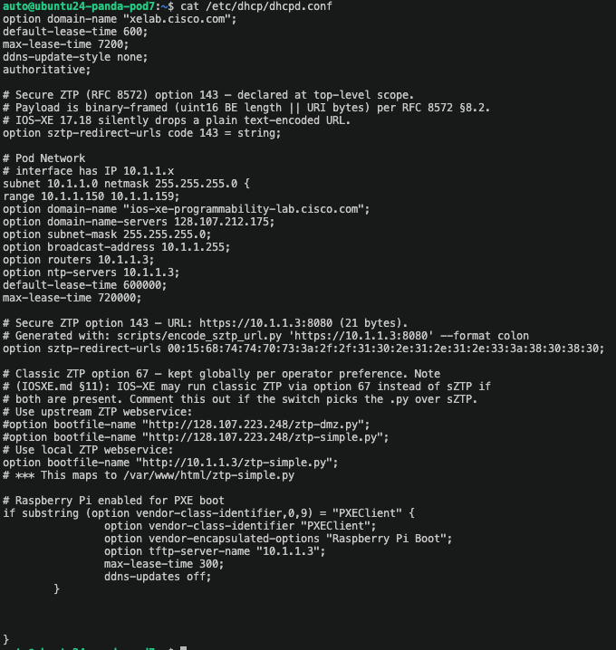
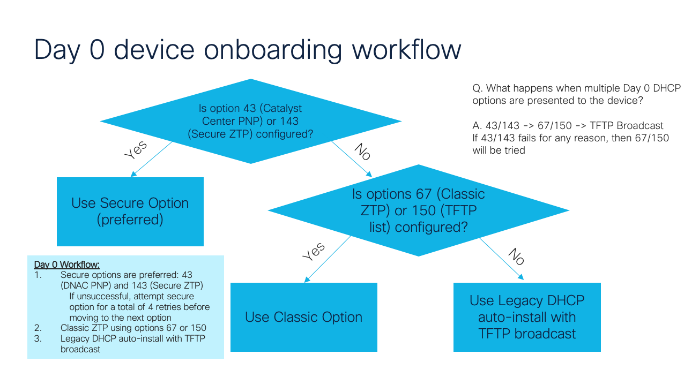
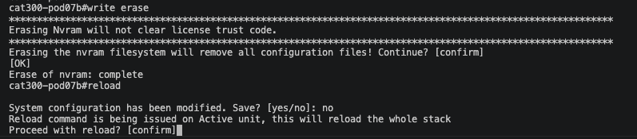
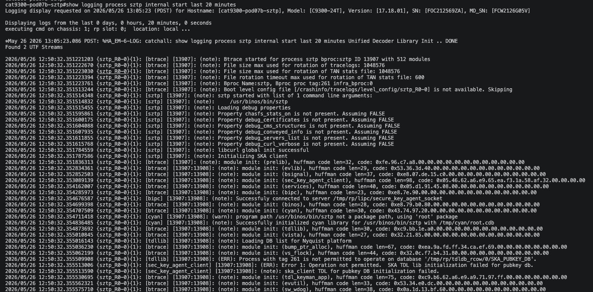
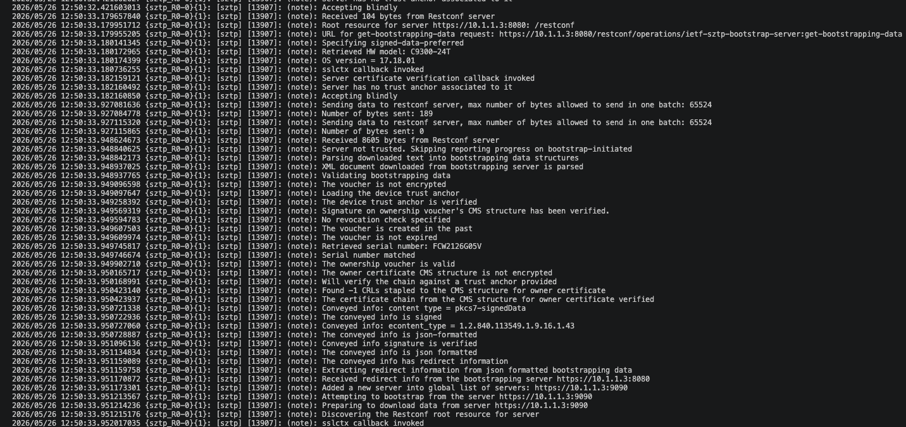
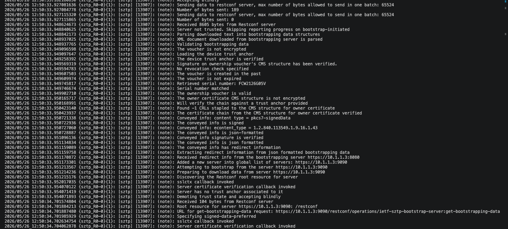
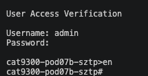

# Secure Zero Touch Provisioning (SZTP)

## What is SZTP?

Secure Zero Touch Provisioning (SZTP) is an automated, secure method for onboarding enterprise network devices. It enables devices to bootstrap themselves with minimal manual intervention while maintaining strong security through certificate-based authentication.

### SZTP Workflow

1. **Device Powers On**: New device boots up for the first time
2. **DHCP Discovery**: Device obtains IP and bootstrap server information
3. **Ownership Verification**: Device contacts MASA to verify ownership voucher
4. **Bootstrap Configuration**: Device downloads initial configuration
5. **Production Ready**: Device joins the network with proper config and credentials

## Ownership Voucher Generation

The first step in SZTP is generating ownership vouchers for your devices. An ownership voucher is a cryptographically signed artifact from the Manufacturer Authorized Signing Authority (MASA) that proves your organization owns specific devices. These vouchers are essential for secure device onboarding and prevent unauthorized devices from joining your network.

### Understanding MASA

Cisco's MASA service (https://masa.cisco.com) validates device ownership and generates ownership vouchers. When you request a voucher, MASA verifies:

1. Your organization has a valid entitlement for the device serial number
2. The device hasn't been claimed by another organization
3. Your API token has proper authorization

The MASA service then generates a signed ownership voucher that your bootstrap server presents to the device during the SZTP process. This ensures that only devices you own can successfully onboard to your network.

**📚 For complete instructions on obtaining a MASA API token and generating ownership vouchers, see the [SZTP Scripts README](../resources/sztp/README.md) in this repository.**

### Prerequisites

- Cisco MASA account and API token (see [SZTP README](../resources/sztp/README.md) for details)
- Device serial numbers
- Domain certificate for authentication

### Quick Start

For detailed instructions on generating ownership vouchers, see the [SZTP Scripts Documentation](../resources/sztp/README.md).

**Basic steps:**

1. **Set MASA token**:
   ```bash
   export MASA_API_TOKEN="your-token-here"
   ```

2. **Generate certificate**:
   ```bash
   openssl ecparam -out pinned-domain-cert.key -name prime256v1 -genkey
   openssl req -new -sha256 -key pinned-domain-cert.key -out pinned-domain-cert.csr
   openssl x509 -req -sha256 -days 365 -in pinned-domain-cert.csr -signkey pinned-domain-cert.key -out pinned-domain-cert.crt
   ```

3. **Generate vouchers**:
   ```bash
    cd docs/resources/sztp/
   ./run_bulk_vouchers.sh --serial-source pod-devices-table.md
   ```

### SZTP Scripts

The repository includes comprehensive scripts for voucher generation:

- **masa_ov_request.py**: Request new vouchers from MASA
- **masa_get_voucher.py**: Download existing vouchers
- **run_bulk_vouchers.sh**: Bulk voucher generation

📚 **Full documentation**: [SZTP README](../resources/sztp/README.md)

## Bootstrap Server Setup

After generating ownership vouchers, you need to set up a bootstrap server to deliver configurations to devices.

### Bootstrap Server Components

1. **DHCP Server**: Provides bootstrap server URL via option 143
2. **Web Server**: Hosts bootstrap configuration files
3. **Certificate Authority**: Issues device certificates
4. **Configuration Templates**: Device-specific configs

### Example Bootstrap Configuration

```json
{
  "ietf-sztp-bootstrap-server:bootstrap-information": {
    "boot-image": {
      "download-uri": "https://bootstrap.example.com/images/iosxe-17.12.1.bin",
      "image-verification": {
        "hash-algorithm": "sha-256",
        "hash-value": "a1b2c3..."
      }
    },
    "configuration": {
      "download-uri": "https://bootstrap.example.com/configs/device-{{serial}}.cfg"
    },
    "ownership-voucher": {
      "artifact": "base64-encoded-voucher"
    }
  }
}
```

## Device Onboarding Demo

Use this section in two phases:

- **A) Core components in this lab** sets the stage and explains the architecture.
- **B) One-switch runbook** is where the hands-on work begins.

If you want to jump directly to hands-on: [Go to B) One-switch runbook](#hands-on-runbook)

### A) Core components in this lab

1. Switch (IOS-XE client)
    - Sends DHCP discover, learns option 143, then performs mTLS to the SZTP server.

2. DHCP server
    - Delivers RFC 8572 option 143 containing the redirecter URL.
    - In this lab, URL is `https://10.1.1.3:8080`.

3. Redirecter service (sztpd redirect mode, port 8080)
    - Returns redirect-information pointing the switch to bootstrap on port 9090.

4. Bootstrap service (sztpd running mode, port 9090)
    - Verifies device identity and returns signed onboarding-information.
    - In this repo it maps the C9300 PID to `first-onboarding-information`.

5. Voucher and owner certificates
    - Ownership voucher and owner cert chain establish ownership trust.
    - Files are mounted from local_files.

6. Artifact payloads
    - first-configuration.xml (minimal placeholder config)
    - first-pre-configuration-script.sh (actual day-0 switch config logic)
    - Optional post script and image artifacts

<a id="hands-on-runbook"></a>
### B) One-switch runbook (recommended sequence)

Target switch in this lab: **C9350 at `10.1.1.15`**.

1. Review DHCP behavior on the VM first

    Before touching the switch, confirm how DHCP advertises Day 0 options:

    ```sh
    cat /etc/dhcp/dhcpd.conf
    ```

    

    Optional quick filter:

    ```sh
    grep -nE '143|67|bootfile|filename|sztp|autoinstall' /etc/dhcp/dhcpd.conf
    ```

    What to look for:

    - **Secure SZTP option 143** (bootstrap server-list/URL for SZTP redirect/bootstrap).
    - **Classic ZTP option 67** (bootfile/script path used by legacy ZTP flows).

    Selection order in this lab follows secure-first onboarding from the workflow:

    1. SZTP (option 143)
    2. Classic ZTP (option 67)
    3. Autoinstall (fallback)

    

    *DHCP on the VM advertises secure SZTP first, then classic ZTP, then autoinstall fallback.*

2. Console to the C9350 switch (`10.1.1.15`)

    ```sh
    console-helper
    ```

    Optional direct access:

    ```sh
    ssh admin@10.1.1.15
    ```

3. Set your lab values in env file

    Edit config/catalyst/c9300.env:

    ```sh
    SZTP_URL=https://10.1.1.3:8080
    SZTP_DEVICE_SN=C9300-24T
    SZTP_VOUCHER_FILE=/local_files/FCW2126G05V.vcj
    SZTP_OWNER_CERT_FILE=/local_files/owner_cert_chain.cms
    ```

4. Validate ownership artifacts before bringing up containers

    ```sh
    scripts/validate-sztp-artifacts.sh
    ```

5. Choose DHCP mode

    - Option A: Use container DHCP

    ```sh
    docker compose --env-file config/catalyst/c9300.env --profile dhcp up -d
    ```

    - Option B: Use existing upstream DHCP (as used in this lab). Ensure option 143 is correctly encoded and points to 10.1.1.3:8080.

6. Confirm containers are up

    ```sh
    docker ps --format 'table {{.Names}}\t{{.Status}}'
    ```

    Expected: sztp-bootstrap-1 and sztp-redirecter-1 are present and healthy.

    If they are not up, run:

    ```sh
    docker compose --env-file config/catalyst/c9300.env up -d
    docker ps --format 'table {{.Names}}\t{{.Status}}'
    ```

    Pre-demo check: inspect mounted SZTP files in the bootstrap container

    1. Confirm mount points from host VM into bootstrap container:

    ```sh
    docker inspect sztp-bootstrap-1 --format '{{range .Mounts}}{{println .Source " -> " .Destination}}{{end}}'
    ```

    2. Inspect the expected artifact folder inside the container:

    ```sh
    docker exec -it sztp-bootstrap-1 sh -lc 'ls -lah /local_files'
    ```

    3. Verify voucher and owner cert files are present:

    ```sh
    docker exec -it sztp-bootstrap-1 sh -lc 'ls -lah /local_files/*.vcj /local_files/*owner* 2>/dev/null'
    ```

    4. Locate pre and post configuration payload files:

    ```sh
    docker exec -it sztp-bootstrap-1 sh -lc 'find / -type f \( -name "*pre*config*" -o -name "*post*config*" -o -name "*onboarding*" -o -name "*.xml" -o -name "*.sh" \) 2>/dev/null | sort'
    ```

    5. Confirm runtime SZTP environment paths the container is using:

    ```sh
    docker exec -it sztp-bootstrap-1 sh -lc 'env | grep "^SZTP_" | sort'
    ```

    What to confirm before continuing:

    - `SZTP_VOUCHER_FILE` and `SZTP_OWNER_CERT_FILE` point to valid files visible in container.
    - `first-pre-configuration-script.sh` and any post/script payloads are present.
    - Host-to-container mount mapping includes your expected artifact directory.

7. Run preflight checks

    ```sh
    scripts/sztp-preflight.sh --env-file config/catalyst/c9300.env
    ```

8. Verify bootstrap patches/log markers and SBI behavior

    ```sh
    docker logs sztp-bootstrap-1 2>&1 | grep -E 'sitecustomize:' | sort -u
    SZTP_URL=https://10.1.1.3:8080 bash scripts/verify-sztp.sh
    ```

    Expected verify result: 401 access-denied (this is good and confirms mTLS endpoint behavior).

9. Reset and reload the switch (`10.1.1.15`) so SZTP re-triggers

    ```text
    enable
    write erase
    yes
    reload
    no
    yes
    ```
    Example:

    

    *Steps to trigger SZTP process to begin*

10. Watch onboarding from host and switch (`10.1.1.15`)

    On host:

    ```sh
    docker logs -f sztp-bootstrap-1 2>&1 | grep -iE 'signed|onboard|injected|error|404'
    ```

    On switch:

    ```text
    show logging process sztp internal start last 20 minutes
    ```

    Examples (captured in sequence). There are log snips omitted between each screenshot.

    

    *Important in image 1: confirm option 143/bootstrap-server-list discovery and redirect start (8080 path).* 

    

    *Important in image 2: confirm voucher and owner certificate chain verification success (no reject/fail markers).* 

    

    *Important in image 3: confirm conveyed/signed onboarding information accepted and transition toward successful completion.*

    Reference example: [Full SZTP internal logs example](sztp-internal-logs-example.md)

11. Confirm successful end state

        - Switch sees bootstrap-server-list from option 143.
    - Voucher signature and owner certificate chain verification pass.
    - Conveyed information is signed and accepted.
    - Day-0 configurations from first-pre-configuration-script.sh are applied.

    

      *Validation checks and expected 401 access-denied indicate correct mTLS endpoint behavior*

### C) Fast troubleshooting checklist (single switch)

1. No SZTP attempt seen
    - Recheck DHCP option 143 framing and run write erase before reload.

2. 404 or RPC path errors
    - Ensure SZTP_URL is scheme + host + port only (no RESTCONF path).

3. Certificate chain verification failures
    - Re-run scripts/validate-sztp-artifacts.sh and confirm voucher, PDC, and owner chain match.

4. Redirect works but onboarding fails
    - Check device registration key and mapping in sztpd templates and bootstrap logs.

5. SZTP containers are not running
    - Start them with docker compose and re-check status.
    - Commands:

    ```sh
    docker compose --env-file config/catalyst/c9300.env up -d
    docker ps --format 'table {{.Names}}\t{{.Status}}'
    ```

## Security Considerations

- **Certificate Validation**: Always validate device and server certificates
- **Encrypted Transport**: Use HTTPS for all bootstrap communications
- **Ownership Vouchers**: Store vouchers securely
- **Access Control**: Restrict bootstrap server access
- **Audit Logging**: Monitor all onboarding activities

## Troubleshooting

### Device Not Bootstrapping

**Check DHCP option 143**:
```bash
# On DHCP server
show ip dhcp binding
```

**Verify bootstrap server reachability**:
```bash
# From device (10.1.1.15)
ping bootstrap.example.com
```

### Ownership Voucher Rejected

- Verify voucher was generated for correct serial number
- Check certificate validity period
- Ensure MASA registration is current
- Validate voucher format (must be valid JSON)

### Configuration Download Failed

- Check bootstrap server HTTPS certificate
- Verify configuration file exists at specified URL
- Ensure device has internet connectivity
- Check firewall rules

## Additional Resources

- [IETF RFC 8572 - Secure Zero Touch Provisioning](https://datatracker.ietf.org/doc/html/rfc8572)
- [Cisco blog - Secure ZTP overview](https://blogs.cisco.com/developer/secureztp01)
- [Cisco SZTP Documentation](https://www.cisco.com/c/en/us/support/docs/switches/catalyst-9000/sztp-guide.html)
- [SZTP Scripts Repository](https://github.com/sdeweese/sztp)
- [SZTP Scripts README](../resources/sztp/README.md)
- [MASA OV generation script (bulk)](../resources/sztp/run_bulk_vouchers.sh)
- [MASA OV download script (single serial)](../resources/sztp/masa_get_voucher.py)

## Cisco Live On-Demand Sessions (Relevant)

Use the Cisco Live Session Catalog and search by session ID/title (availability varies by event and release timing):

- Cisco Live Session Catalog: https://www.ciscolive.com/global/learn/session-catalog.html
- LTRENS-1680: Unlock the Foundation, Explore the Future (includes Day 0 SZTP onboarding)
- DEVNET-1232: Swagger Into RESTCONF: Navigating the IOS XE API and DevNet Sandboxes
- BRKOPS-2594: Navigating the SNMP-Free Journey with Model-Driven Telemetry
- DEVWKS-2810: The Atomic Shift (NETCONF/YANG and ACR workflow)

For the full curated IOS XE session list used by this lab, see: [Cisco Live IOS XE sessions](https://github.com/sdeweese/CLUS26-LTRENS-1680-Cisco-IOS-XE-Programmability-Lab-Unlock-the-Foundation-Explore-the-Future/blob/main/CLUS26-IOS-XE-Sessions.md)

---

## Next Steps

✅ Completed: Day 0 - SZTP Onboarding

**Continue your learning journey:**

➡️ [Day 1: Device Configuration Overview](../day-1/index.md) - Learn configuration management with ACR, Terraform, and Ansible

**Or explore:**
- [Atomic Config Replace](../day-1/atomic-operations.md)
- [Back to Day 0 Overview](index.md)
