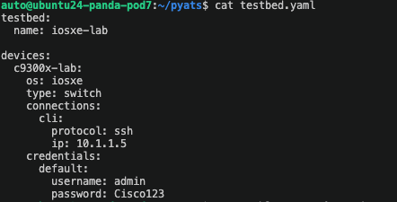
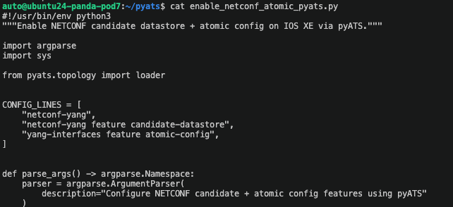
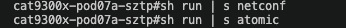
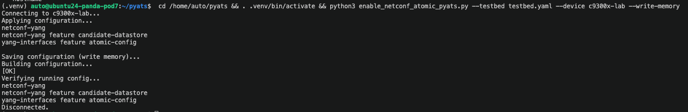
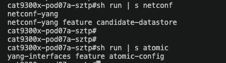

# PyATS Testing

## Automated Testing with Cisco PyATS

Use this section to apply required Day 1 platform features with a single PyATS script.

## Goal

Configure the following on the C9300X lab switch (`10.1.1.5`):

```text
netconf-yang
netconf-yang feature candidate-datastore
yang-interfaces feature atomic-config
```

## Prerequisites

1. PyATS/Unicon installed in your active Python environment.
2. SSH reachability to `10.1.1.5`.
3. Credentials for `c9300x-lab` (default lab values: `admin` / `Cisco123`).

## Testbed Example

Create `testbed.yaml`:

```yaml
testbed:
  name: iosxe-lab

devices:
  c9300x-lab:
	os: iosxe
	type: switch
	connections:
	  cli:
		protocol: ssh
		ip: 10.1.1.5
	credentials:
	  default:
		username: admin
		password: Cisco123
```

## Single PyATS Script

Save as `enable_netconf_atomic_pyats.py`:

```python
#!/usr/bin/env python3
"""Enable NETCONF candidate datastore + atomic config on IOS XE via pyATS."""

import argparse
import sys

from pyats.topology import loader


CONFIG_LINES = [
	"netconf-yang",
	"netconf-yang feature candidate-datastore",
	"yang-interfaces feature atomic-config",
]


def parse_args() -> argparse.Namespace:
	parser = argparse.ArgumentParser(
		description="Configure NETCONF candidate + atomic config features using pyATS"
	)
	parser.add_argument(
		"--testbed",
		required=True,
		help="Path to testbed YAML file",
	)
	parser.add_argument(
		"--device",
		default="c9300x-lab",
		help="Device name in testbed YAML (default: c9300x-lab)",
	)
	parser.add_argument(
		"--write-memory",
		action="store_true",
		help="Save running-config to startup-config after applying changes",
	)
	return parser.parse_args()


def main() -> int:
	args = parse_args()

	testbed = loader.load(args.testbed)
	if args.device not in testbed.devices:
		print(f"ERROR: Device '{args.device}' not found in testbed file {args.testbed}")
		return 2

	device = testbed.devices[args.device]

	print(f"Connecting to {args.device}...")
	device.connect(log_stdout=False)

	try:
		print("Applying configuration...")
		result = device.configure(CONFIG_LINES)
		print(result)

		if args.write_memory:
			print("Saving configuration (write memory)...")
			print(device.execute("write memory"))

		print("Verifying running config...")
		print(device.execute("show running-config | section netconf-yang"))
		print(device.execute("show running-config | include atomic-config"))

	finally:
		device.disconnect()
		print("Disconnected.")

	return 0


if __name__ == "__main__":
	sys.exit(main())
```

## Review Before Running

Before executing the script, inspect the testbed and script files directly.

1. Review the testbed target:

	```bash
	cat testbed.yaml
	```

	Confirm it targets the C9300X switch at `10.1.1.5`.

	

2. Review the script logic:

	```bash
	cat enable_netconf_atomic_pyats.py
	```

	Confirm the script will configure these lines:

	```text
	netconf-yang
	netconf-yang feature candidate-datastore
	yang-interfaces feature atomic-config
	```

	

## PyATS Before Verification

Before running the script, verify the target config is not yet present on the device.



## Helper Script (run_pyats.sh)

Use this helper script to run the PyATS workflow end-to-end.

Helper file in this repo:

- [docs/resources/pyats/run_pyats.sh](../resources/pyats/run_pyats.sh)

Script content:

```bash
#!/usr/bin/env bash
set -euo pipefail

SCRIPT_DIR="$(cd "$(dirname "${BASH_SOURCE[0]}")" && pwd)"
VENV_DIR="${SCRIPT_DIR}/.venv"

DEVICE="c9300x-lab"
TESTBED="${SCRIPT_DIR}/testbed.yaml"
WRITE_MEMORY="--write-memory"

usage() {
	cat <<'EOF'
Usage:
	./run_pyats.sh [--device NAME] [--testbed PATH] [--no-write-memory]

Examples:
	./run_pyats.sh
	./run_pyats.sh --device c9300x-lab
	./run_pyats.sh --testbed /home/auto/pyats/testbed.yaml --no-write-memory
EOF
}

while [[ $# -gt 0 ]]; do
	case "$1" in
		--device)
			DEVICE="$2"
			shift 2
			;;
		--testbed)
			TESTBED="$2"
			shift 2
			;;
		--no-write-memory)
			WRITE_MEMORY=""
			shift
			;;
		-h|--help)
			usage
			exit 0
			;;
		*)
			echo "Unknown argument: $1"
			usage
			exit 2
			;;
	esac
done

if [[ ! -f "${TESTBED}" ]]; then
	echo "ERROR: testbed file not found: ${TESTBED}"
	exit 2
fi

if [[ ! -d "${VENV_DIR}" ]]; then
	echo "Creating virtual environment at ${VENV_DIR}"
	python3 -m venv "${VENV_DIR}"
fi

# shellcheck source=/dev/null
source "${VENV_DIR}/bin/activate"

if ! python -c "import pyats,unicon,genie" >/dev/null 2>&1; then
	echo "Installing required packages: pyats unicon genie"
	python -m pip install --upgrade pip setuptools wheel
	python -m pip install pyats unicon genie
fi

cd "${SCRIPT_DIR}"

CMD=(python3 enable_netconf_atomic_pyats.py --testbed "${TESTBED}" --device "${DEVICE}")
if [[ -n "${WRITE_MEMORY}" ]]; then
	CMD+=("${WRITE_MEMORY}")
fi

echo "Running: ${CMD[*]}"
"${CMD[@]}"
```

How it works:

1. Creates `.venv` if missing.
2. Activates `.venv`.
3. Installs `pyats`, `unicon`, and `genie` only if missing.
4. Runs `enable_netconf_atomic_pyats.py` with your selected testbed/device.

Usage:

```bash
cd /home/auto/pyats
chmod +x run_pyats.sh
./run_pyats.sh
```

Optional flags:

```bash
./run_pyats.sh --device c9300x-lab
./run_pyats.sh --testbed testbed.yaml
./run_pyats.sh --no-write-memory
```

## Run It

Follow this flow in order:

1. Change to the pyATS working directory:

```bash
cd /home/auto/pyats
```

2. Create a virtual environment (one-time only):

```bash
python3 -m venv .venv
```

3. Activate the virtual environment (required in each new terminal/session):

```bash
source .venv/bin/activate
```

4. Upgrade packaging tools (recommended one-time):

```bash
python -m pip install --upgrade pip setuptools wheel
```

5. Install required packages (one-time unless you recreate the venv):

```bash
python -m pip install pyats unicon genie
```

6. Verify pyATS installation:

```bash
pyats version check
```

7. Run the script:

```bash
python3 enable_netconf_atomic_pyats.py --testbed testbed.yaml --device c9300x-lab --write-memory
```

8. Exit the virtual environment when done:

```bash
deactivate
```

## PyATS Demo Output

Example of what successful script execution looks like:



```text
(.venv) auto@ubuntu24-panda-pod7:~/pyats$ python3 enable_netconf_atomic_pyats.py --testbed testbed.yaml --device c9300x-lab --write-memory
Connecting to c9300x-lab...
Applying configuration...
netconf-yang
netconf-yang feature candidate-datastore
yang-interfaces feature atomic-config
Saving configuration (write memory)...
Building configuration...
[OK]
Verifying running config...
netconf-yang
 netconf-yang feature candidate-datastore
yang-interfaces feature atomic-config
Disconnected.
```

What to look for:

1. No Python traceback or connection/authentication errors.
2. `Building configuration... [OK]` after `write memory`.
3. Verification output includes all three required lines.

## Validation Commands on Device

SSH to the C9300X device first:

```bash
ssh admin@10.1.1.5
```

Then run:

```text
show running-config | section netconf-yang
show running-config | include atomic-config
```

Expected lines present:

```text
netconf-yang
netconf-yang feature candidate-datastore
yang-interfaces feature atomic-config
```

## PyATS After Verification

After running the script, confirm the configuration lines are now present.



## Using PyATS with RESTCONF/NETCONF Payloads (Not Covered in This Lab)

Per PyATS usage patterns, you can use PyATS as the test orchestration layer (testbed loading, device targeting, assertions, reporting) and send protocol payloads with Python clients inside the same test/script.

1. RESTCONF flow (high level):
	- Load device IP/credentials from `testbed.yaml`.
	- Send HTTPS requests to RESTCONF endpoints (for example `/restconf/data/...`) using a Python HTTP client.
	- Validate response codes/body, then assert expected state with follow-up operational checks.

2. NETCONF flow (high level):
	- Use device connection details from the PyATS testbed.
	- Open NETCONF session on port `830` with a NETCONF client library.
	- Send XML payloads with `edit-config`/`get-config`, then assert post-change state in test steps.

This lab intentionally keeps scope to the PyATS CLI-based script shown above for enabling NETCONF candidate datastore and atomic-config prerequisites.

# Resources
Learn more about PyATS at: [https://developer.cisco.com/docs/pyats](https://developer.cisco.com/docs/pyats).


---

## Next Steps

✅ Completed: Day 1 - PyATS Testing

**Ready for Day 2?**

➡️ [Day 2: Device Monitoring Overview](../day-2/index.md) - Learn OpenTelemetry and gNXI

**Or return to:**
- [Day 1 Overview](index.md)
- [Atomic Config Replace](atomic-operations.md)
