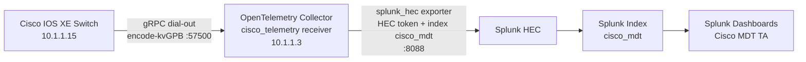
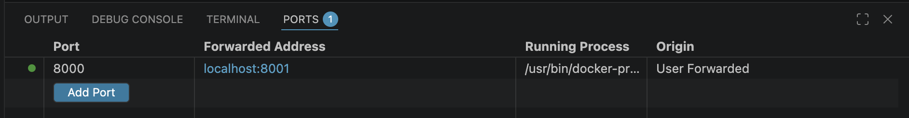
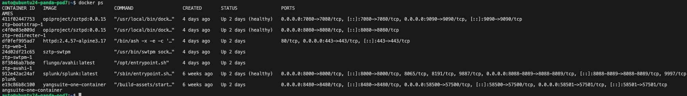

# OpenTelemetry + Splunk (OTel-Only Guide)

## Day 2 Device Monitoring with OpenTelemetry and Splunk

This guide is intentionally focused on one pipeline:

Cisco IOS XE -> OpenTelemetry Collector (`cisco_telemetry` receiver) -> Splunk HEC -> Splunk dashboards

It does not cover alternate collectors or time-series stacks.

## Day 2 Feature Context (Short History)

This lab sits on the progression of IOS XE model-driven telemetry:

1. Device exports model-based telemetry streams over gRPC.
2. OpenTelemetry collector normalizes and forwards data.
3. Splunk ingests the stream through HEC.
4. Splunk TA dashboards provide the operational view used in this session.

In short: Day 2 takes model-driven telemetry and turns it into dashboard-ready operational visibility.

## Splunk Components

These three terms are different parts of the same solution:

1. Splunk (platform)
  - The full Splunk service and web UI where you search data and view dashboards.
  - In this lab, you access it from Splunk Web (typically port `8000`, or forwarded `8001` in remote pod environments).

2. Splunk HEC (HTTP Event Collector)
  - The ingestion API endpoint used by the OTel collector exporter to send telemetry into Splunk.
  - In this lab, HEC listens on port `8088` and uses a token (for example `cisco-mdt-token`).
  - HEC is for data ingest, not dashboard viewing.

3. Splunk TA (Technology Add-on)
  - A Splunk app package that provides field mappings, saved searches, dashboards, and content for a specific data domain.
  - In this lab, the Cisco MDT TA content is used to visualize telemetry once data is already indexed in Splunk.

How they work together in this lab:

- OTel collector exports telemetry -> Splunk HEC
- HEC writes data into Splunk index (`cisco_mdt`)
- Splunk TA dashboards read that indexed data for visualization

## Feedback-Aligned Focus for This Lab

This page is optimized for the exact demo flow requested:

1. Validate OTel collector and Splunk are running.
2. Review the script that applies the full IOS XE subscription set (already run for students).
3. Confirm data is flowing from switch -> collector -> Splunk.
4. Show dashboards in Splunk.

Reference links used in this update:

- OTel contrib YANG gRPC receiver: https://github.com/open-telemetry/opentelemetry-collector-contrib/tree/main/receiver/yanggrpcreceiver
- Receiver config/README: https://github.com/open-telemetry/opentelemetry-collector-contrib/blob/main/receiver/yanggrpcreceiver/README.md
- Receiver implementation discussion: https://github.com/open-telemetry/opentelemetry-collector-contrib/pull/44015
- Splunk TA (Cisco MDT): https://splunkbase.splunk.com/app/7125

## Lab Values Used in This Guide

- IOS XE device IP: `10.1.1.15`
- OTel collector host IP: `10.1.1.3`
- Telemetry receiver port: `57500`
- Splunk Web: `http://localhost:8000`
- Splunk HEC: `https://localhost:8088`

## TA Quick Path (What to Show First)

Use this sequence during demos to prove switch-to-Splunk telemetry quickly:

1. Show the script used to enable all subscriptions and note it is already applied in this lab image.
2. Validate OTel collector and Splunk are both running.
3. Focus on Splunk TA dashboards as the source of truth for indexed metrics.
4. Confirm end-to-end data flow from `10.1.1.15` to Splunk.
5. Open Splunk dashboards and verify live updates.

## What You Will Build

By the end of this lab you will:

1. Run Splunk and an OTel collector that can ingest Cisco IOS XE gRPC dial-out telemetry.
2. Configure IOS XE telemetry subscriptions to send `encode-kvgpb` data to the collector.
3. Validate end-to-end flow from switch to Splunk.
4. Import and use prebuilt Splunk dashboards for telemetry analysis.

## Architecture



## Upstream Reference Implementation

This Day 2 workflow aligns with Jeremy Cohoe's receiver project:

- https://github.com/jeremycohoe/otel-grpc-cisco-receiver

Key files in that repo used by this guide:

- `docker-compose.yaml`
- `docker-collector-config.yaml`
- `collector-config.yaml`
- `start-splunk.sh`
- `start-otel.sh`
- `scripts/import-dashboards.sh`
- `c9300x-mdt-subscriptions.cfg`
- `configure-mdt.py`
- `scripts/fetch-yang-models.sh`

## Prerequisites

1. Docker and Docker Compose available on the host.
2. Reachability between IOS XE device and OTel collector host on telemetry port `57500`.
3. IOS XE device with telemetry support (17.x+ recommended).
4. Lab access to the switch console/CLI.

## Step 1: Change to the OTel Lab Directory

```bash
cd otel-grpc-cisco-receiver
```

## Step 2: Start Splunk + OTel Collector

Use either helper scripts or Compose.

### Option A (helper scripts)

```bash
./start-splunk.sh
./start-otel.sh
./scripts/import-dashboards.sh
```

### Option B (Compose)

```bash
docker compose up -d
```

With the default Compose setup, you should have:

1. OTel collector listening on `57500` for telemetry.
2. OTel self-metrics endpoint on `8888`.
3. Splunk Web on `8000`.
4. Splunk HEC on `8088`.

Default lab credentials and HEC values (as documented in the upstream repo):

- Splunk user: `admin`
- Splunk password: `Cisco123`
- HEC token: `cisco-mdt-token`
- Metrics index: `cisco_mdt`

### Port-forwarding note for remote lab environments

If you are running in a remote pod/VM workspace with forwarded ports:

1. At the top of the terminal window, click the `PORTS` tab.
2. Delete all existing forwarded ports.
3. Click `Forward a Port`, enter `8000`, and press Enter.
4. The environment will auto-generate a localhost URL (typically `localhost:8001`).
5. Open that link in a browser (you may need `Cmd+Click`).
6. Sign in to Splunk using lab credentials.



Use this when direct access to host port `8000` is not available from your laptop.

## Step 2a: Verify Containers with `docker ps`

After startup, verify both Splunk and OTel containers are running:

```bash
docker ps
```

Look for:

1. A Splunk container in `Up` state.
2. Port mapping that includes `8000->8000/tcp` (Splunk Web).
3. Port mapping that includes `8088->8088/tcp` (Splunk HEC).
4. OTel collector container in `Up` state.



### Access Splunk Web on Port 8000

Once `docker ps` shows Splunk mapped to port `8000`, open Splunk Web:

- On the same host: `http://localhost:8000`
- From another machine: `http://<docker-host-ip>:8000`

Login with the default lab credentials from above (`admin` / `Cisco123`), then proceed to dashboard validation.

If your environment requires forwarded access, use the forwarded `8001` URL instead.

## Step 3: (Optional but Recommended) Pull IOS XE YANG Models

The receiver works without downloaded models, but model files improve metadata quality and key propagation for broader path coverage.

```bash
./scripts/fetch-yang-models.sh
```

To target a specific IOS XE release, use the script argument shown in the upstream README.

## Step 4: Configure IOS XE Telemetry to OTel Collector

Set subscriptions to push to collector `10.1.1.3:57500` using `grpc-tcp` (or `grpc-tls` if TLS is enabled in collector config).

### Minimal example subscription

```text
telemetry ietf subscription 101
 encoding encode-kvgpb
 filter xpath /interfaces-ios-xe-oper:interfaces/interface/statistics
 source-address 10.1.1.15
 stream yang-push
 update-policy periodic 30000
 receiver ip address 10.1.1.3 57500 protocol grpc-tcp
```

### Full subscription set (already enabled for students)

For richer dashboards, this lab uses the predefined subscription bundle:

- `c9300x-mdt-subscriptions.cfg`

The automation script used to apply that full set is:

- `configure-mdt.py`

This step has already been completed for students before lab start.

If you need to re-run it for troubleshooting, use:

```bash
pip install netmiko
python3 configure-mdt.py --host 10.1.1.15 --collector 10.1.1.3
```

## Step 5: Verify Data Flow

## On the switch

```text
show telemetry ietf subscription all
show telemetry ietf subscription 101 detail
show telemetry ietf subscription 101 receiver
```

Confirm subscriptions are valid and receiver state is healthy.

## On the collector host

Check collector self-metrics for receiver activity:

```bash
curl -s http://localhost:8888/metrics | grep cisco_telemetry
```

You should see counters increasing (messages/bytes/connections).

## Against Splunk search API

```bash
curl -sk -u admin:Cisco123 \
  'https://localhost:8089/services/search/jobs' \
  -d 'search=| mcatalog values(metric_name) WHERE index=cisco_mdt | stats count' \
  -d output_mode=json -d exec_mode=oneshot
```

A non-zero count indicates metrics are indexed.

## Step 6: Use Splunk Dashboards

1. Open Splunk Web.
2. Confirm dashboards are imported (or run `./scripts/import-dashboards.sh`).
3. Confirm Splunk TA content is available (Cisco MDT app/context).
4. Validate key dashboard categories:
   - Overview
   - Infrastructure
   - Network
   - Routing
   - Power and PoE
   - Security
   - Telemetry Health

## Telemetry Subscription to Dashboard Mapping

Use this mapping to connect subscription intent to Splunk dashboard outcomes.

| Subscription Source | Example Path / Scope | Expected Dashboard Area | Quick Verification |
|---|---|---|---|
| `telemetry ietf subscription 101` (sample in this guide) | `/interfaces-ios-xe-oper:interfaces/interface/statistics` | Network, Infrastructure, Overview | `show telemetry ietf subscription 101 detail` + Splunk metric search count in `cisco_mdt` |
| Full bundle from `c9300x-mdt-subscriptions.cfg` | Multiple platform and interface paths | Overview, Network, Routing, Power and PoE, Security, Telemetry Health | `show telemetry ietf subscription all` + dashboard panels populated across categories |
| Script-applied full set via `configure-mdt.py` | Same as bundle above, programmatically applied | Same as bundle above | Re-run dashboard checks after script confirms apply success |

Interpretation guidance:

1. If subscriptions are healthy on-device but dashboards are sparse, validate receiver/exporter counters and YANG model availability.
2. If only interface charts populate, the full bundle may not be fully applied.
3. Use this mapping during demos to explain why specific dashboard panels are populated.

## Model Coverage Notes (for Dashboard Value)

To highlight YANG model innovation and why dashboards populate correctly:

1. Ensure full subscription coverage is enabled (not just a single sample path).
2. Pull YANG models with `./scripts/fetch-yang-models.sh` when possible.
3. Verify collector metrics include active receiver processing.
4. Verify Splunk index `cisco_mdt` has current metric names and values.

This is the practical link between model-driven telemetry and ready-to-use dashboards.

## Troubleshooting (OTel + Splunk Only)

### No telemetry reaching collector

1. Verify switch receiver IP/port/protocol in subscription config.
2. Confirm collector is listening on `57500`.
3. Validate routing/firewall between switch and collector host.

### Collector sees traffic but Splunk is empty

1. Verify `splunk_hec` endpoint/token/index in collector config.
2. Confirm Splunk HEC service is enabled.
3. Check collector logs for exporter retry/drop messages.

### Dashboard panels show sparse dimensions

1. Add/download YANG models and point `models_dir` appropriately.
2. Re-check configured subscription paths versus dashboard expectations.

### TLS/mTLS issues

1. Use `grpc-tls` on switch only when collector TLS is configured.
2. Validate certificate chain/trustpoint setup.
3. Align switch trust settings with collector `tls` server settings.

## Recommended Operational Checks

Run these checks each time you update subscriptions:

1. `show telemetry ietf subscription all` on switch.
2. `curl http://localhost:8888/metrics | grep cisco_telemetry` on collector.
3. Splunk search proving metric name cardinality in `cisco_mdt` index.
4. Dashboard panel refresh with current time range.

## References

- OTel Cisco telemetry receiver project:
  - https://github.com/jeremycohoe/otel-grpc-cisco-receiver
- Splunk setup details in upstream repo:
  - https://github.com/jeremycohoe/otel-grpc-cisco-receiver/blob/main/SPLUNK-SETUP.md
- OTel collector config reference in upstream repo:
  - https://github.com/jeremycohoe/otel-grpc-cisco-receiver/blob/main/docs/CONFIG.md
- Security and TLS reference in upstream repo:
  - https://github.com/jeremycohoe/otel-grpc-cisco-receiver/blob/main/docs/SECURITY.md

---

## Lab Transition

Wrapping up Day 2:

1. Return to your lab VM terminal and keep Splunk/collector status noted.
2. If port forwarding was enabled, close it when no longer needed.
3. Confirm telemetry verification commands completed successfully before switching modules.

## Next Step

Continue to [Day N: Device Optimization](../day-n/index.md).
