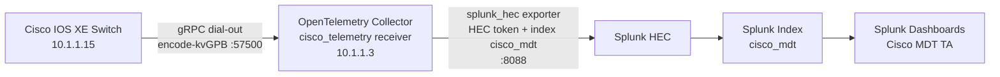

# OpenTelemetry + Splunk Guide

## Day 2: Device Monitoring with OpenTelemetry and Splunk

This guide is intentionally focused on one pipeline:

Cisco IOS XE -> OpenTelemetry Collector (`cisco_telemetry` receiver) -> Splunk HEC -> Splunk dashboards

## Day 2 Feature Context (Short History)

This lab sits on the progression of IOS XE model-driven telemetry:

1. The device exports model-based telemetry streams over gRPC.
2. An OpenTelemetry collector normalizes and forwards the data.
3. Splunk ingests the stream through HEC.
4. Splunk TA dashboards provide the operational view used in this session.

In short: Day 2 takes model-driven telemetry and turns it into dashboard-ready operational visibility.

## Splunk Components

These three terms are different parts of the same solution:

1. **Splunk (platform)** — the full Splunk service and web UI where data is searched and dashboards are viewed. Splunk Web is on port `8000` (or a forwarded `8001` in remote pods).
2. **Splunk HEC (HTTP Event Collector)** — the ingestion API endpoint the OTel collector exporter writes into. HEC listens on `8088` and uses a token (`cisco-mdt-token`). HEC is for ingest, not viewing.
3. **Splunk TA (Technology Add-on)** — a Splunk app package that provides field mappings, saved searches, and dashboards for a specific data domain. The Cisco MDT TA visualizes telemetry once it is indexed.

How they fit together in the running lab:

- OTel collector exports telemetry → Splunk HEC.
- HEC writes into Splunk index `cisco_mdt`.
- Splunk TA dashboards read that indexed data for visualization.

## Lab Values (Pre-Configured for You)

| Item | Value |
|---|---|
| IOS XE device IP | `10.1.1.15` |
| OTel collector host IP | `10.1.1.3` |
| Telemetry receiver port | `57500` |
| Splunk Web | `http://localhost:8000` (or forwarded `8001`) |
| Splunk HEC | `https://localhost:8088` |
| HEC token | `cisco-mdt-token` |
| Metrics index | `cisco_mdt` |
| Splunk login | `admin` / `Cisco123` |

## Architecture



## Upstream Reference Implementation

This Day 2 workflow is built on the upstream OpenTelemetry Cisco IOS XE
telemetry receiver and the Splunk distribution of the OTel collector:

- OTel contrib YANG gRPC receiver (the `cisco_telemetry`-style decoder): <https://github.com/open-telemetry/opentelemetry-collector-contrib/tree/main/receiver/yanggrpcreceiver>
- Splunk distribution of the OpenTelemetry collector: <https://github.com/signalfx/splunk-otel-collector>
- Cisco IOS XE Model-Driven Telemetry reference (subscriptions, YANG paths): <https://github.com/jeremycohoe/cisco-ios-xe-mdt>

File types that drive what is running in the lab pod (delivered pre-staged on
the collector host — you don't need to open them, but they’re named here so you
recognize them in the slide deck):

- `docker-compose.yaml`
- `docker-collector-config.yaml`
- `collector-config.yaml`
- `start-splunk.sh`
- `start-otel.sh`
- `scripts/import-dashboards.sh`
- `c9300x-mdt-subscriptions.cfg`
- `configure-mdt.py`
- `scripts/fetch-yang-models.sh`

## What Was Pre-Built for You

The pod was bootstrapped before lab start with the following:

1. Docker and Docker Compose installed on the collector host.
2. The Splunk container and OTel collector container started via `docker compose up -d`.
3. Splunk dashboards imported via `./scripts/import-dashboards.sh`.
4. IOS XE YANG models pulled via `./scripts/fetch-yang-models.sh` for richer metadata.
5. The full IOS XE subscription bundle (`c9300x-mdt-subscriptions.cfg`) applied to `10.1.1.15` via `configure-mdt.py`.

You do **not** need to re-run any of these.

## Example: A Single Telemetry Subscription

This is one of the subscriptions already configured on the switch. Read it to
see the shape of model-driven telemetry config:

```text
telemetry ietf subscription 101
 encoding encode-kvgpb
 filter xpath /interfaces-ios-xe-oper:interfaces/interface/statistics
 source-address 10.1.1.15
 stream yang-push
 update-policy periodic 30000
 receiver ip address 10.1.1.3 57500 protocol grpc-tcp
```

What to notice:

- `encode-kvgpb` is Key-Value Google Protocol Buffers — the wire format the OTel `cisco_telemetry` receiver decodes.
- `stream yang-push` + `update-policy periodic 30000` = push every 30 seconds.
- The `receiver` line is where the switch dials out to the OTel collector at `10.1.1.3:57500`.

### Same Subscription, Two Interfaces (from TECOPS-2314)

The TECOPS-2314 deck shows that every telemetry subscription has both a CLI and
a YANG (NETCONF/RESTCONF/gNMI) representation — they configure the exact same
`Cisco-IOS-XE-mdt-cfg` operational data:

| Via CLI | Via YANG (`Cisco-IOS-XE-mdt-cfg`) |
|---|---|
| `telemetry ietf subscription 101` | `mdt-config-data` → `mdt-subscription` → `subscription-id: 101` |
| `encoding encode-kvgpb` | `base.encoding: encode-kvgpb` |
| `stream yang-push` | `base.stream: yang-push` |
| `update-policy periodic 6000` | `base.period: 6000` |
| `filter xpath /memory-ios-xe-oper:memory-statistics/...` | `base.xpath: /memory-ios-xe-oper:memory-statistics/...` |
| `receiver ip address 10.1.1.3 57500 protocol grpc-tcp` | `mdt-receivers.address: 10.1.1.3`, `port: 57500` |

This is why the same lab works whether subscriptions are pushed via raw CLI,
NETCONF (the atomic-config Day 1 module), Ansible, Terraform, or gNMI — the
device stores it once and streams identically to the OTel collector.

### Advanced Pattern: EEM-Driven On-Change Telemetry

Beyond periodic `yang-push`, IOS XE can stream **event-driven** telemetry via
the `Cisco-IOS-XE-ios-events-oper` model. An EEM applet calls
`action export-to-telemetry`, which publishes a YANG notification on the
`yang-notif-native` stream — same OTel pipeline, but on-change instead of
periodic:

```text
telemetry ietf subscription 12123
 encoding encode-kvgpb
 filter xpath /ios-events-ios-xe-oper:eem-event-publish
 stream yang-notif-native
 update-policy on-change
 receiver ip address 10.1.1.3 57500 protocol grpc-tcp
!
event manager applet catchall
 event cli pattern ".*" sync no skip no
 action 1 syslog msg "$_cli_msg"
 action 2 export-to-telemetry $_cli_msg
```

Use case from the deck: capture every CLI typed on a VTY and stream it as a
structured telemetry event to Splunk for audit and change-tracking — no SNMP
trap, no syslog parser, no polling.

## Splunk Dashboards (The Main Event)

Open Splunk Web and browse the Cisco MDT app. These dashboard categories are
pre-populated from the live subscription bundle:

- Overview
- Infrastructure
- Network
- Routing
- Power and PoE
- Security
- Telemetry Health

### Subscription → Dashboard Mapping

| Subscription Source | Example Path / Scope | Dashboard Area |
|---|---|---|
| Single sample subscription (`101`) | `/interfaces-ios-xe-oper:interfaces/interface/statistics` | Network, Infrastructure, Overview |
| Full bundle (`c9300x-mdt-subscriptions.cfg`) | Multiple platform and interface paths | Overview, Network, Routing, Power and PoE, Security, Telemetry Health |

### Port-Forwarding Note for Remote Lab Environments

If your pod runs in a remote workspace with forwarded ports:

1. At the top of the terminal window, click the **PORTS** tab.
2. Delete all existing forwarded ports.
3. Click **Forward a Port**, enter `8000`, press Enter.
4. The environment auto-generates a localhost URL (typically `localhost:8001`).
5. Open it in a browser (you may need `Cmd+Click`).
6. Sign in as `admin` / `Cisco123`.


## Reference Verification Commands (For Your Notes)

These are the commands the lab builders use to confirm the pipeline is healthy.
You don't need to run them — they're here so you recognize them when you see
them in the slide deck or the upstream repo.

On the switch:

```text
show telemetry ietf subscription all
show telemetry ietf subscription 101 detail
show telemetry ietf subscription 101 receiver
```

On the collector host:

```bash
curl -s http://localhost:8888/metrics | grep cisco_telemetry
```

Against the Splunk search API:

```bash
curl -sk -u admin:Cisco123 \
  'https://localhost:8089/services/search/jobs' \
  -d 'search=| mcatalog values(metric_name) WHERE index=cisco_mdt | stats count' \
  -d output_mode=json -d exec_mode=oneshot
```

## Model Coverage Notes (Why Dashboards Populate)

The link between model-driven telemetry and ready-to-use dashboards depends on
four things, all already in place in this lab:

1. Full subscription coverage (the bundle, not just a single sample path).
2. YANG models cached locally on the collector for metadata enrichment.
3. Active receiver processing visible in collector self-metrics.
4. Current metric names and values in the Splunk `cisco_mdt` index.

## References

- OTel contrib YANG gRPC receiver (decodes IOS XE kvGPB MDT): <https://github.com/open-telemetry/opentelemetry-collector-contrib/tree/main/receiver/yanggrpcreceiver>
- Splunk distribution of the OpenTelemetry collector: <https://github.com/signalfx/splunk-otel-collector>
- Splunk HEC exporter (used in this pipeline): <https://github.com/open-telemetry/opentelemetry-collector-contrib/tree/main/exporter/splunkhecexporter>
- Splunk Add-On for OpenTelemetry Collector: <https://splunkbase.splunk.com/app/7125>
- Cisco IOS XE Model-Driven Telemetry reference: <https://github.com/jeremycohoe/cisco-ios-xe-mdt>
- Cisco IOS XE Programmability Configuration Guide (26.x): <https://www.cisco.com/c/en/us/td/docs/ios-xml/ios/prog/configuration/26x/26x-programmability-cg.html>
- TECOPS-2314 Cisco Live deck — *Programmability and Automation with Cisco IOS XE* (MDT subscription CLI↔YANG mapping, EEM event-publish telemetry): [TECOPS-2314 slides (PDF)](../resources/slides/TECOPS-2314-Programmability-and-Automation-with-Cisco-IOS-XE.pdf)

## Next Step

Continue to [Day N: Device Optimization](../day-n/index.md).
