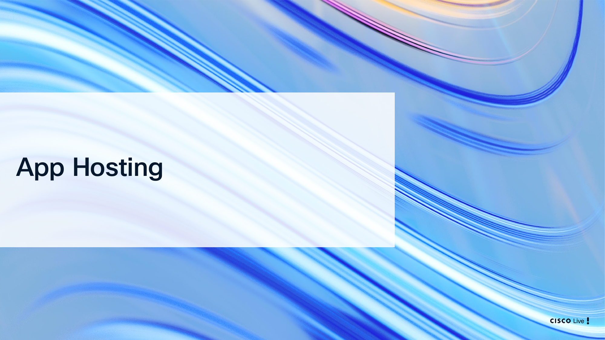
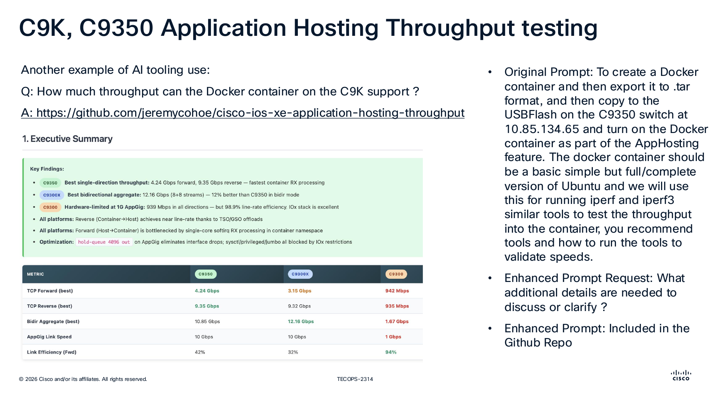
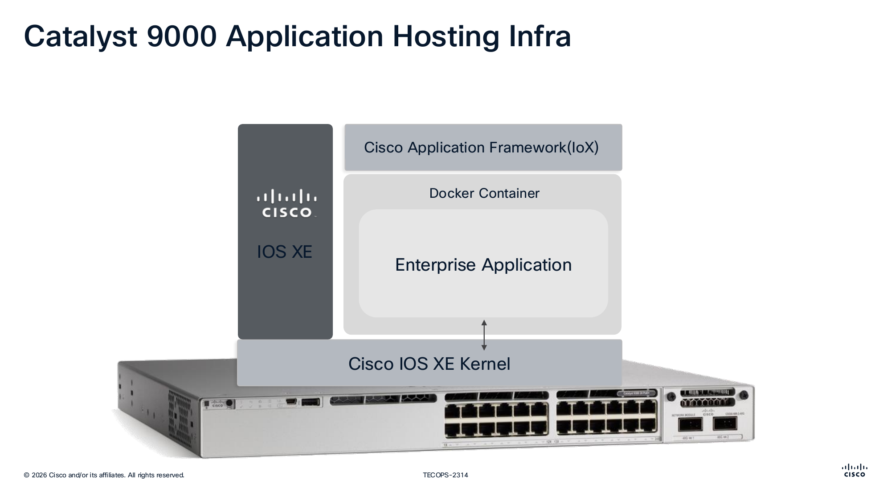
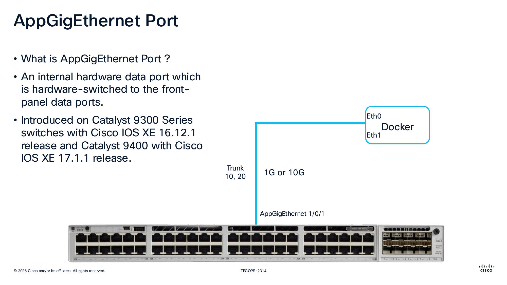
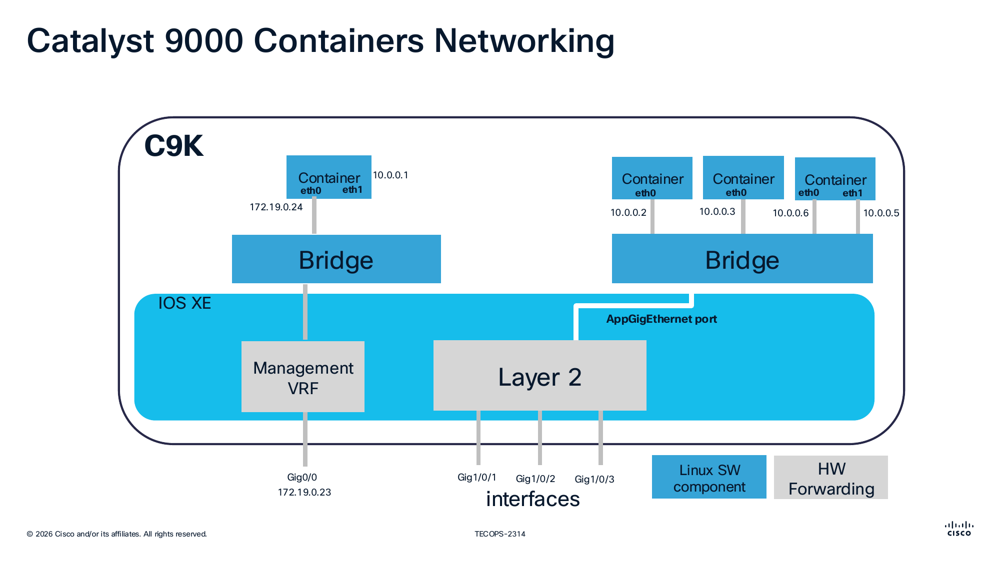
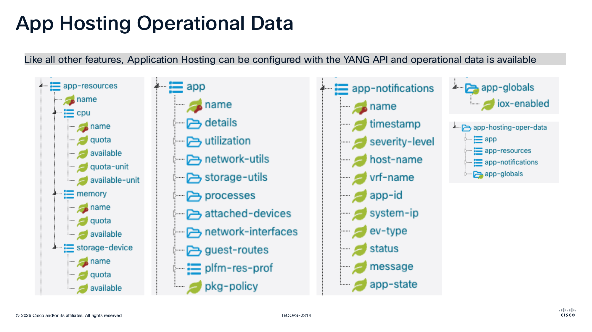
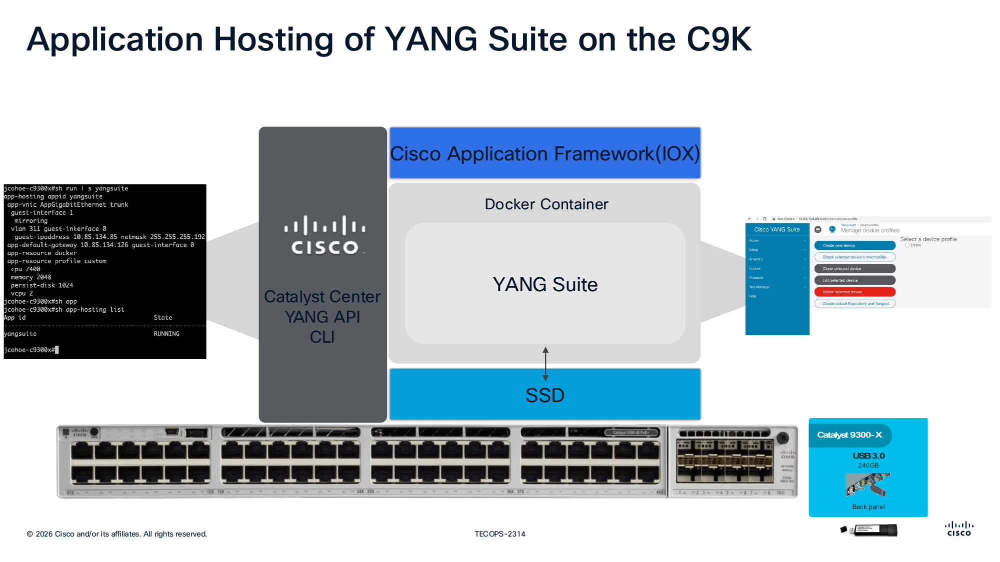
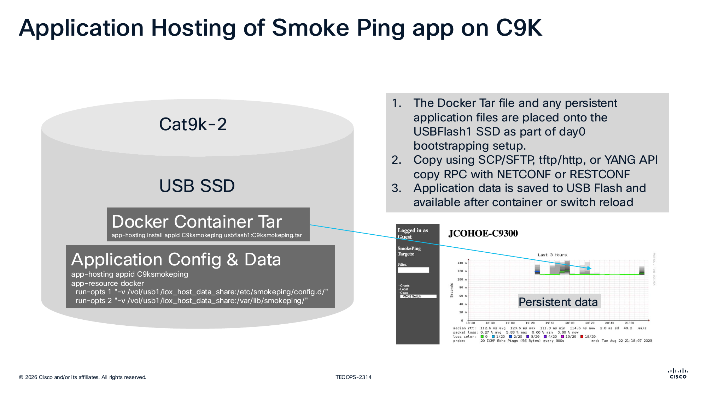
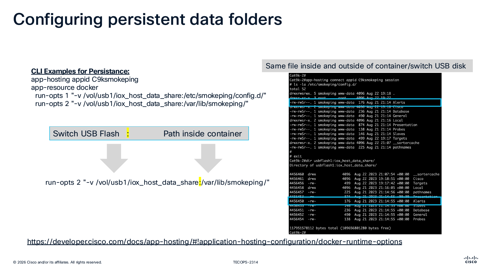
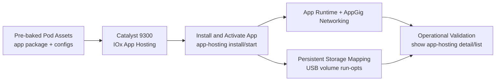

# Application Hosting with Smart Switch

## Day N App Hosting (Lecture-Aligned Lab)

This module is aligned to the Cisco Live App Hosting content and uses a pre-staged lab workflow.

In this lab, students do not build a container image from scratch. Instead, they validate and operate a pre-baked application hosting setup on Catalyst hardware.

## What You Will Learn

1. How App Hosting fits into Catalyst optimization workflows.
2. The key building blocks: IOx framework, container runtime, AppGig networking, and persistent storage.
3. How to verify an app package is installed, activated, and operational.
4. How to validate persistent data mounts used by containerized applications.

## App Hosting Slide Context

These slides from the session deck provide architecture context for this lab flow.

### Slide: App Hosting Section Intro



This slide marks the transition into Application Hosting as the Day N optimization topic. It is important because it frames app hosting as an operations capability, not just a platform feature.

### Slide: C9K/C9350 Throughput Use Case



This slide presents a practical throughput-testing use case using a containerized toolset on the switch. It is important because it connects App Hosting to measurable validation outcomes students can reproduce.

### Slide: Catalyst 9000 App Hosting Infrastructure



This slide shows the IOx framework and container runtime relationship inside IOS XE. It is important because students can visualize where their app runs in relation to the switch OS and hardware resources.

### Slide: AppGigEthernet Data Path



This slide explains AppGigEthernet as the internal high-speed data path between hosted apps and front-panel switching. It is important for understanding how container traffic enters and leaves the application environment.

### Slide: Container Networking on C9K



This slide illustrates container interfaces and addressing patterns used in hosted app networking. It is important because network reachability troubleshooting depends on understanding these interface mappings.

### Slide: App Hosting Operational Data via YANG



This slide highlights that App Hosting is model-driven with both configuration and operational state available over APIs. It is important because the lab emphasizes programmatic verification, not only CLI checks.

### Slide: YANG Suite Hosted on C9K



This slide gives a concrete example of hosting YANG Suite directly on Catalyst hardware. It is important because it demonstrates real edge use cases where tooling runs on-device for local operations.

### Slide: SmokePing Packaging and Install Flow



This slide walks through package placement and `app-hosting install` workflow using USB-backed storage. It is important because it maps directly to the install/activate command sequence students validate in this lab.

### Slide: Persistent Data Folder Mapping



This slide explains Docker `run-opts` volume mappings between switch storage and container paths. It is important because persistence across app restart or switch reload is a core operational requirement.

## Lab Model (Pre-Baked for Students)

The pod image is prepared with App Hosting assets so students can focus on operations and validation:

1. Application package tar and related files are pre-staged.
2. Required bootstrapping has already been completed on the source VM.
3. Students run verification and lifecycle commands rather than building images.

## Quick Workflow

1. Verify the app-hosting environment on the switch.
2. Confirm package/app presence and runtime status.
3. Validate app networking and reachability.
4. Validate persistent storage mapping.

## Day N Architecture (Lab Workflow)



This diagram shows the lab-first model: students validate and operate a pre-staged app-hosting workflow rather than building the container image from scratch.

## Step 1: Verify App Hosting Prerequisites on Device

SSH to the target switch and verify app-hosting capability:

```bash
ssh admin@10.1.1.5
```

Run:

```text
show app-hosting list
show app-hosting utilization
show app-hosting detail appid <your-app-id>
```

Expected outcome:

1. The target application ID appears in the app list.
2. Resource utilization is visible.
3. App detail output shows deployment/runtime state.

## Step 2: Validate App Package and Activation Flow

Use the pre-staged package and confirm lifecycle operations.

Representative install pattern from slide workflow:

```text
app-hosting install appid <your-app-id> usbflash1:<your-app-package>.tar
app-hosting appid <your-app-id>
 app-vnic AppGigabitEthernet trunk
 app-default-gateway 10.0.0.1 guest-interface 0
 start
```

Then verify status:

```text
show app-hosting list
show app-hosting detail appid <your-app-id>
```

Expected outcome:

1. App state reports running/activated.
2. Network-facing app interface information is populated.

## Step 3: Validate Persistent Data Mapping

App Hosting commonly maps USB-backed directories into container paths for persistence.

Representative persistent mapping pattern:

```text
app-hosting appid <your-app-id>
 app-resource docker
  run-opts 1 "-v /vol/usb1/iox_host_data_share:/etc/<app>/config.d/"
  run-opts 2 "-v /vol/usb1/iox_host_data_share:/var/lib/<app>/"
```

Verify after reload/restart that app data remains available.

## Step 4: Operational Validation (What Students Should Prove)

Students should capture evidence for:

1. App is installed and in running state.
2. App networking is configured (AppGig/guest interface data present).
3. Persistent storage paths are mapped.
4. App functionality is reachable per lab scenario.

## Troubleshooting Quick Checks

1. App not running:
	- Check `show app-hosting detail appid <your-app-id>` for startup errors.
2. Package issues:
	- Verify package file exists on `usbflash1:` and app ID matches commands.
3. Connectivity issues:
	- Verify AppGig/app-vnic settings and gateway config.
4. Data not persistent:
	- Re-check `run-opts` volume mount paths and USB storage availability.

## Notes for Instructors/TAs

1. Keep this lab focused on validate/operate workflows rather than image build mechanics.
2. Use the slide visuals above to explain architecture before students run commands.
3. If needed, demonstrate one install/start cycle, then let students perform verification tasks.

## References

1. Cisco App Hosting developer documentation:
	- https://developer.cisco.com/docs/app-hosting/
2. Docker runtime options for app hosting:
	- https://developer.cisco.com/docs/app-hosting/#!application-hosting-configuration/docker-runtime-options

---

## Lab Transition

Before ending Day N or moving to another module:

1. Return from switch CLI to your lab VM terminal.
2. Record app-hosting verification evidence (running state, mounts, reachability).
3. If required by your lab workflow, stop or reset app instances to baseline.

## Next Steps

✅ Completed: Day N - Application Hosting

**Explore additional resources:**

➡️ [Resources Overview](../resources/index.md) - YANG Suite, Sandboxes, and APIs

**Or return to:**
- [Day N Overview](index.md)
- [Day 2: Device Monitoring](../day-2/index.md)
