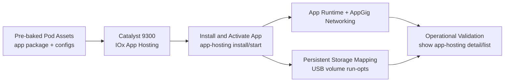

# Application Hosting with Smart Switch

## Day N App Hosting Reference Guide


This module is aligned to the Cisco Live App Hosting content and uses a pre-staged lab workflow. Students validate by reading; no commands are issued against the switch.

## What You Will Learn

1. How App Hosting fits into Catalyst optimization workflows.
2. The key building blocks: IOx framework, container runtime, AppGig networking, and persistent storage.
3. What a healthy `app-hosting` install/activate sequence looks like.
4. What persistent data mounts look like for containerized applications.

## App Hosting Slide Context

These slides from the session deck provide architecture context for this walkthrough.

### Slide: App Hosting Section Intro


This slide marks the transition into Application Hosting as the Day N optimization topic. It frames app hosting as an operations capability, not just a platform feature.

### Slide: C9K/C9300 Throughput Use Case


A practical throughput-testing use case using a containerized toolset on the switch. It connects App Hosting to measurable validation outcomes.

### Slide: Catalyst 9000 App Hosting Infrastructure


Shows the IOx framework and container runtime relationship inside IOS XE. Useful for visualizing where an app runs in relation to the switch OS and hardware resources.

### Slide: AppGigEthernet Data Path


Explains AppGigEthernet as the internal high-speed data path between hosted apps and front-panel switching — how container traffic enters and leaves the app environment.

### Slide: Container Networking on C9K


Illustrates container interfaces and addressing patterns used in hosted app networking — the basis for any reachability troubleshooting.

### Slide: App Hosting Operational Data via YANG


App Hosting is model-driven: configuration and operational state are available over APIs, not only CLI.

### Slide: YANG Suite Hosted on C9K


A concrete example of hosting YANG Suite directly on Catalyst hardware — a real edge use case where tooling runs on-device for local operations.

### Slide: SmokePing Packaging and Install Flow


Walks through package placement and the `app-hosting install` workflow using USB-backed storage. Maps directly to the install/activate command sequence shown below.

### Slide: Persistent Data Folder Mapping


Explains Docker `run-opts` volume mappings between switch storage and container paths — the basis for persistence across app restart or switch reload.

## What Was Pre-Built for You

The pod was bootstrapped before lab start with the following:

1. Application package tar staged on `usbflash1:`.
2. App installed and activated on the Catalyst 9300.
3. AppGig data path and guest-interface networking wired up.
4. Persistent USB-backed volume mounts configured.

You do **not** need to install, start, or stop the app.

## Day N Architecture (Lab Workflow)



## Example: App Install + Activation (Reference Only)

This is the install/activate pattern from the slide deck — the same sequence
that was already run on your pod's switch. Read it; do not run it.

```text
app-hosting install appid <your-app-id> usbflash1:<your-app-package>.tar
app-hosting appid <your-app-id>
 app-vnic AppGigabitEthernet trunk
 app-default-gateway 10.0.0.1 guest-interface 0
 start
```

What to notice:

- `app-hosting install` stages the package from local flash.
- The `app-hosting appid <id>` block defines the **runtime networking**: an AppGig trunk vNIC and a default gateway tied to a guest interface.
- `start` is the lifecycle verb that flips the app to running.

### Example: Verification Output

The lab builders confirm the app is up using these reads:

```text
show app-hosting list
show app-hosting utilization
show app-hosting detail appid <your-app-id>
```

Expected:

1. The app ID appears in the list with state `RUNNING`.
2. CPU/memory utilization is visible.
3. App detail shows AppGig vNIC info and any mounted volumes.

## Example: Persistent Data Mapping (Reference Only)

App Hosting commonly maps USB-backed directories into container paths so data
survives restart/reload. The pattern looks like this:

```text
app-hosting appid <your-app-id>
 app-resource docker
  run-opts 1 "-v /vol/usb1/iox_host_data_share:/etc/<app>/config.d/"
  run-opts 2 "-v /vol/usb1/iox_host_data_share:/var/lib/<app>/"
```

Why this matters:

1. Without `run-opts -v`, any container-local state is lost when the app or switch restarts.
2. USB-backed mounts give you durable config and data on the switch itself — no external storage.
3. Multiple `run-opts` entries let one volume be projected into several container paths.

## Things to Notice While You Walk Through the Module

1. The lifecycle verbs — `install`, `start`, `stop`, `uninstall` — are first-class IOS XE CLI, not something tacked on.
2. AppGig is the data-plane bridge between the switch ASIC and the hosted container.
3. All of the above is exposed via YANG, so the same config can be driven by NETCONF/RESTCONF (think back to Day 1).
4. Persistent storage via `run-opts` is what makes on-box apps practical for operations, not just demos.

## References

- Cisco App Hosting developer documentation: <https://developer.cisco.com/docs/app-hosting/>
- Docker runtime options for app hosting: <https://developer.cisco.com/docs/app-hosting/#!application-hosting-configuration/docker-runtime-options>

## Next Steps

✅ Completed: Day N — Application Hosting (review-only)

**Explore additional resources:**

➡️ [Resources Overview](../resources/index.md) — YANG Suite, Sandboxes, and APIs

**Or return to:**

- [Day N Overview](index.md)
- [Day 2: Device Monitoring](../day-2/index.md)
